<!-- Pokeball Header -->
<p align = "center">
	
</p>
<p align = "center">
	
</p>
<div align="center">


<br>


# 👋 안녕하세요, 백종석입니다!

### 🚀 열정적인 풀스택 개발자가 되고 싶은 SSAFY 교육생

<div align="center">
  
</div>

</div>

<!-- Pokeball Design Start -->
<details open>
<summary>
<div align="center">
  
  <br>
  <b><font color="#6C5CE7" size="4">🔴 Click to Open Pokeball! 🔴</font></b>
  <br>
  <b><font color="#6C5CE7">백종석의 프로필이 들어있어요!</font></b>
</div>
</summary>

<div align="center">
<h2>✨ Welcome to My GitHub Profile! ✨</h2>
<p><em>포켓볼에서 나온 백종석의 모든 정보를 확인해보세요!</em></p>

---

## 🧑‍💻 About Me

<div align="left">

```javascript
const baekJongseok = {
    name: "백종석 (Baek Jongseok)",
    role: "Full Stack Developer in Training",
    education: "SSAFY 13기 (비전공자 과정)",
    location: "South Korea 🇰🇷",
    interests: ["Backend Development", "Frontend Development", "Problem Solving"],
    currentlyLearning: ["Python", "Vue.js", "Django", "Javascript"],
    funFact: "비전공자에서 시작해서 개발에 푹 빠진 사람!",
    motto: "꾸준함이 재능을 이긴다 💪"
};
```

</div>

---

## 🛠️ Tech Stack

<details>
<summary>💻 <strong>프로그래밍 언어 & 프레임워크</strong></summary>
<br>

### 🔤 Programming Languages
<div align="center">


</div>

### 🎨 Frontend
<div align="center">


</div>

### ⚙️ Backend
<div align="center">


</div>

### 🗄️ Database
<div align="center">


</div>

### 🛠️ Tools & Development Environment
<div align="center">


</div>

### ☁️ Cloud & Infrastructure
<div align="center">


</div>

</details>

---

## 📈 GitHub 통계

<div align="center">
  
  
</div>

<div align="center">
  
</div>
<p align="center"></p>

---

## 🎯 주요 프로젝트

<details>
<summary>🌟 <strong>프로젝트 더보기</strong></summary>
<br>


<div align="left">

### 🏆 SSAFY 1학기 관통프로젝트

**프로젝트명**: SSAFY 1학기 최종 프로젝트  
**저장소**: [🔗 프로젝트 보러가기](https://github.com/baekjs0123/SSAFY_1st_project)  
**설명**: SSAFY 1학기 과정에서 진행한 관통프로젝트  
**기술 스택**:  


</div>

</details>

---

## 🎓 교육 & 경력

<div align="center">
<table>
  <tr>
    <th>🏫 교육기관</th>
    <th>📅 기간</th>
    <th>📝 상세내용</th>
  </tr>
  <tr>
    <td><strong>SSAFY 13기</strong><br>(삼성 청년 SW 아카데미)</td>
    <td>2025.01.07 ~ 진행중</td>
    <td>• 비전공자 과정<br>• 풀스택 개발 과정<br>• Python, Django, Vue.js 등</td>
  </tr>
</table>
</div>

---

## 🏅 수상 경력

<div align="center">
<table>
  <tr>
    <th>🏆 대회명</th>
    <th>📅 날짜</th>
    <th>🏅 결과</th>
  </tr>
  <tr>
    <td><strong>SSAFY레이스 전국대항전</strong></td>
    <td>2025.05.26 ~ 2025.07.11</td>
    <td>🥈 준우승</td>
  </tr>
</table>
</div>

---

## 🏆 성취 & 활동

<div align="center">
  
</div>

---

## 🎯 2025년 목표

- [x] 🚀 SSAFY 13기 입과 성공
- [ ] 💻 Spring Boot & JPA 마스터하기
- [ ] 🌐 AWS 서비스 깊이 있게 학습하기
- [ ] 📱 의미있는 프로젝트 완성하기
- [ ] 🔍 오픈소스 프로젝트에 기여하기
- [ ] 💼 개발자로 첫 취업하기
- [ ] 📚 CS 기초 지식 탄탄히 다지기

---

## 💭 좋아하는 명언

<div align="center">
<blockquote>
<h3>"천재는 1%의 영감과 99%의 노력이다"</h3>
<p><em>- 토마스 에디슨</em></p>
</blockquote>
</div>

---

## 📫 연락하기

<div align="center">

[](mailto:baekjs0123@naver.com)
[](https://github.com/baekjs0123)

</div>

---

<div align="center">

### 🌱 함께 성장하는 개발자가 되겠습니다! 🌱


</div>

---

<div align="center">
  <i>⭐ <a href="https://github.com/baekjs0123">baekjs0123</a>에서 💙와 함께</i>
</div>

</details>

</div>

<div align=center>
<a href="mailto:baekjs0123@naver.com?subject=Hi%20백종석%20,%20nice%20to%20meet%20you!" target="_blank"></a>
</div>

------
Credit: [baekjs0123](https://github.com/baekjs0123)

Last Edited on: 19/08/2025
